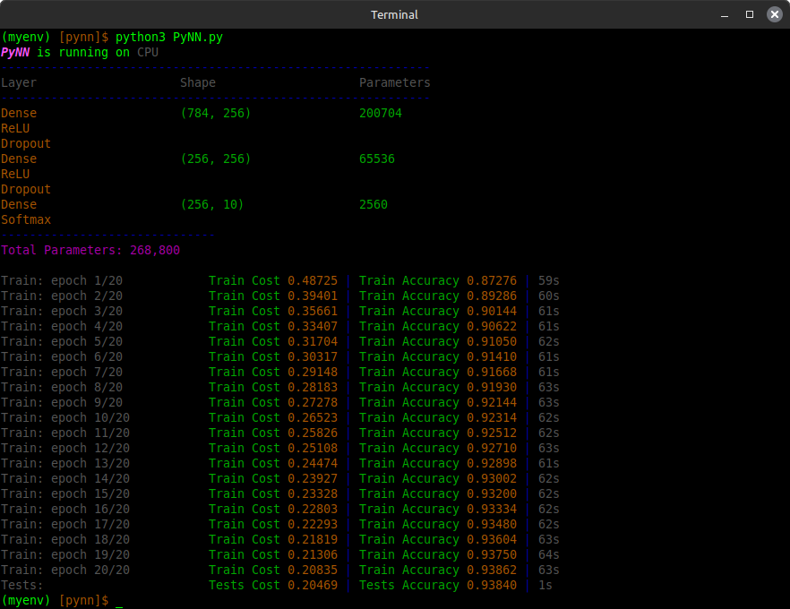

# PyNN
A lightweight NumPy-based neural network library



## Overview
PyNN is a simple and lightweight neural network library built using only NumPy (or CuPy for GPU acceleration). It provides all the basic frameworks for constructing, training, and evaluating neural networks.

## Features
* **Layers:** Dense
* **Activation function:** Step, Linear, Sigmoid, ReLU, Leaky ReLU, TanH, Softmax
* **Loss functions:** MSE, MAE, BCE, CCE
* **Accuracy functions:** Regression, binary, categorical
* **Optimisers:** SGD, adagrad, RMSprop, adam
* **Regularisation:** L1L2, dropout, batch normalisation
* **Weight initialisation algorithms:** zeros, ones, random, glorot, he
* **Saving/loading a model**
* **GPU acceleration**

## Installation
If you want a normal installation using this commandd
```
pip install git+https://github.com/sarisabban/PyNN
```
or if you have a GPU and want the GPU acceleration installation
```
pip install git+https://github.com/sarisabban/PyNN[gpu]
```

## Usage
Building structure for a neural network
```py
from pynn import *

# Any data preparations or cleanup should be done using scikit-learn

model = PyNN()                        # Call the PyNN class, will auto detect the presence of a GPU and switch to it
model.add(model.Dense(INPUT, OUTPUT)) # Dense(INPUT, OUTPUT, alg='glorot uniform', mean=0.0, sd=0.1, a=-0.5, b=0.5, l1w=0, l1b=0, l2w=0, l2b=0)
model.add(model.ReLU())               # Activation functions can be: Step(), Linear(), Sigmoid(), ReLU(), LeakyReLU(alpha=0.01), TanH(), Softmax()
model.add(model.Dense(INPUT, OUTPUT)) # Layers can be: Dense(INPUT, OUTPUT) flatten(X) Dropout(p=0.25) BatchNorm(gamma=1.0, beta=0.0, e=1e-7)
model.add(model.Sigmoid())            # Output activation function

model.show()                          # Show the structure of the built neural network

model.train(
    X_train, Y_train,                                  # Training set
    X_valid, Y_valid,                                  # Validation set
    X_tests, Y_tests,                                  # Test set
    batch_size=32,                                     # Number of examples in a single mini-batch
    loss='bce',                                        # Loss functions: 'MSE', 'MAE', 'BCE', 'CCE'
    accuracy='binary',                                 # Accuracy algorithms: 'regression', 'binary', 'categorical'
    optimiser='sgd',                                   # Optimisers: 'sgd', 'adagrad', 'rmsprop', 'adam'
    lr=0.1, decay=0.0, beta1=0.9, beta2=0.999, e=1e-7, # Optimiser parameters
    early_stop=False,                                  # Currently only tracks plateau of training loss
    epochs=1,                                          # Number of training epochs
    verbose=1)                                         # Training verbosity: 0 for total silence - 1 to show train/valid/test set cost/accuracy outputs - 2 to output everything including mini-batch cost/accuracy

model.save('./model.pkl')             # Save a trained model

model.load('./model.pkl')             # Load the saved model

model.predict(X_VALUE)                # Perform a prediction
```

You can run the following banchmark scripts (requires `pip install scikit-learn`):
* `pynn/regression.py`
* `pynn/binary_classification.py`
* `pynn/categorical_classification.py`
* `pynn/MNIST.py`

## Contributing
Feel free to contribute by submitting issues or pull requests. Ensure your code follows best practices and includes tests.

##TODO:
* Add CNN layer
* Add transformer layer
